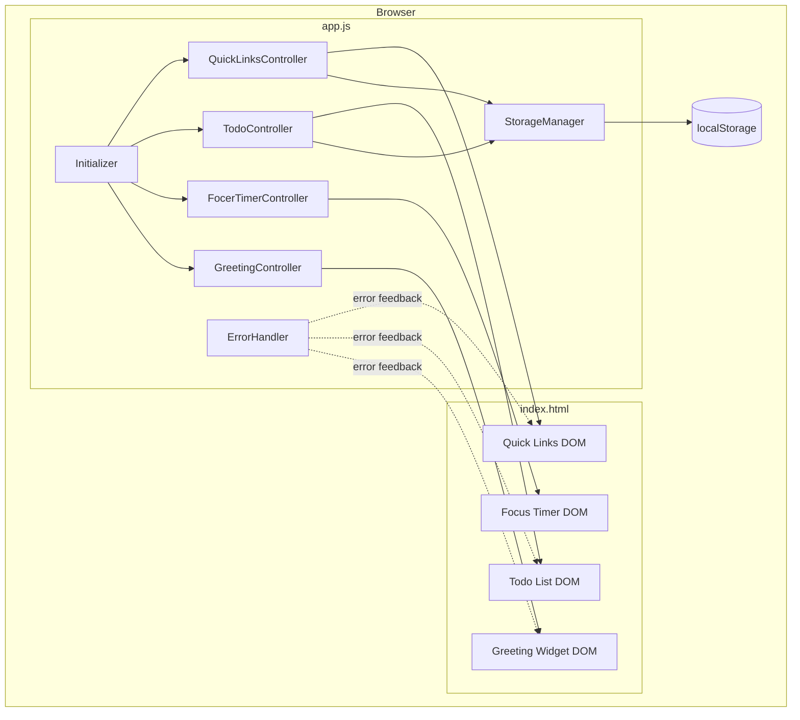
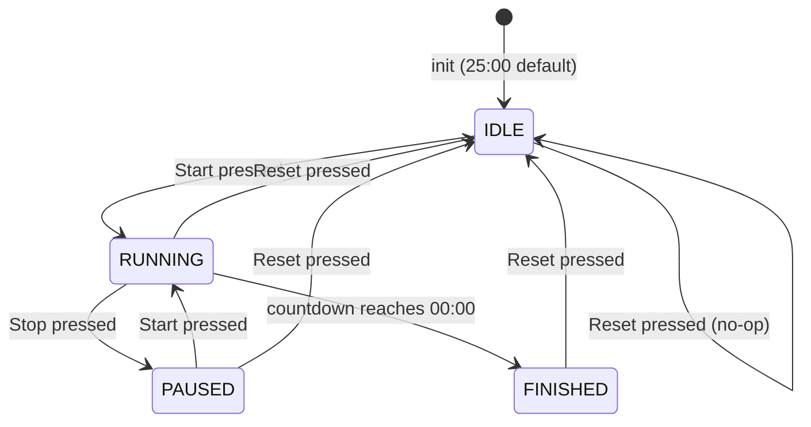

# Design Document: Todo List Life Dashboard

## Overview

Todo List Life Dashboard adalah aplikasi web berbasis klien (*client-side only*) yang menyatukan empat widget produktivitas — **Greeting**, **Focus Timer**, **To-Do List**, dan **Quick Links** — dalam satu halaman tanpa ketergantungan framework atau backend.

Seluruh state dikelola oleh Vanilla JavaScript di browser. Persistensi data menggunakan `localStorage` dengan dua key yang terdefinisi. Tidak ada HTTP request eksternal; semua asset (HTML, CSS, JS) bersifat lokal sehingga aplikasi dapat dibuka via `file://` maupun web server.

**Prinsip arsitektur utama:**
- **Zero dependency** — hanya HTML5, CSS3, dan ES2020 JavaScript.
- **Single-page, no navigation** — semua widget dirender sekaligus dalam satu viewport.
- **Client-side persistence** — `localStorage` sebagai satu-satunya penyimpanan.
- **Event-driven UI** — setiap komponen mengelola state-nya sendiri dan berinteraksi melalui DOM events.
- **Graceful degradation** — jika `localStorage` tidak tersedia, aplikasi tetap berfungsi tanpa penyimpanan.

---

## Architecture

### Struktur File

```
todo-list-life-dashboard/
├── index.html          # Markup utama, memuat satu CSS dan satu JS
├── css/
│   └── style.css       # Semua styling: layout, komponen, responsivitas
└── js/
    └── app.js          # Semua logic: inisialisasi, widget controllers, storage
```

Hanya satu file CSS (`css/style.css`) dan satu file JS (`js/app.js`) sesuai Requirement 6.3.

### Gambaran Arsitektur



### Pola Modul (Module Pattern)

Karena tidak menggunakan bundler atau ES module (agar kompatibel `file://` tanpa server), setiap controller diimplementasikan sebagai **namespace object** di dalam `app.js`. Urutan eksekusi dikendalikan oleh `DOMContentLoaded`.

```
app.js
├── StorageManager         – read/write localStorage, error handling storage
├── Validator              – fungsi validasi input reusable
├── NavbarController       – clock, date display
├── GreetingController     – time-of-day greeting + custom name
├── DogMascotController    – CSS art mascot, expressions by time
├── QuoteController        – random motivational quotes
├── PawPrintsController    – paw prints animation
├── TimeGradientController – background gradient by time of day
├── FocusTimerController   – countdown state machine, button states, duration picker
├── TodoController         – CRUD tasks, badge counter, sort, duplicate prevention
├── QuickLinksController   – CRUD quick links, URL validation
└── AppInitializer         – DOMContentLoaded → init semua controller
```

---

## Components and Interfaces

### 1. GreetingController

**Tanggung jawab:** Menampilkan waktu (HH:MM), tanggal lengkap Bahasa Indonesia, sapaan berdasarkan `Time_Of_Day`, dan input nama personal.

**Interface:**
```javascript
GreetingController.init()
// Load nama dari localStorage, mulai interval 1 detik, render awal
```

**Elemen DOM yang dikelola:**
| Selector | Konten |
|---|---|
| `#greeting-message` | Sapaan ("Selamat Pagi / Siang / Sore / Malam, [Nama]") |
| `#greeting-error` | Indikator error (hidden by default) |
| `#name-input` | Input nama pengguna |

**Logika `Time_Of_Day`:**
```
05:00 – 11:59 → "Selamat Pagi"
12:00 – 14:59 → "Selamat Siang"
15:00 – 17:59 → "Selamat Sore"
18:00 – 04:59 → "Selamat Malam"
```

**Custom Name:**
- Input nama disimpan ke `localStorage` dengan key `todo_dashboard_username`
- Sapaan ditampilkan dalam format "[Sapaan], [Nama]" jika nama ada
- Jika nama kosong, sapaan ditampilkan tanpa nama

**Error handling:** Jika `new Date()` melempar exception, tampilkan `#greeting-error` dan sembunyikan elemen waktu/tanggal/sapaan.

---

### 2. FocusTimerController

**Tanggung jawab:** Mengelola countdown dengan durasi yang dapat dipilih dan state machine yang ketat.

**State Machine:**



**States:**
- `IDLE` — Timer di durasi pilihan, Start aktif, Stop nonaktif.
- `RUNNING` — Countdown berjalan, Start nonaktif, Stop aktif.
- `PAUSED` — Countdown berhenti sementara, Start aktif (lanjut), Stop nonaktif.
- `FINISHED` — Reached 00:00, indikator visual aktif, hanya Reset yang bermakna.

**Interface:**
```javascript
FocusTimerController.init()      // Load durasi dari localStorage, bind duration picker
FocusTimerController.start()     // IDLE/PAUSED → RUNNING
FocusTimerController.stop()      // RUNNING → PAUSED
FocusTimerController.reset()     // any state → IDLE
FocusTimerController._bindDurationPicker()  // Bind dropdown durasi
```

**Elemen DOM:**
| Selector | Konten |
|---|---|
| `#timer-display` | MM:SS countdown |
| `#timer-start-btn` | Tombol Start |
| `#timer-stop-btn` | Tombol Stop |
| `#timer-reset-btn` | Tombol Reset |
| `#timer-finished-indicator` | Visual saat FINISHED (hidden by default) |
| `#timer-duration-select` | Dropdown durasi (5/15/25/30/45/60 mnt) |
| `#timer-fill-circle` | SVG circle progress |

**Duration Picker:**
- Dropdown dengan opsi: 5, 15, 25, 30, 45, 60 menit
- Durasi disimpan ke `localStorage` dengan key `todo_dashboard_timer_duration`
- Saat halaman dimuat, durasi terakhir dipilih dikembalikan

**Implementasi timing:** Menggunakan `setInterval` dengan interval 1000ms. Untuk akurasi, menyimpan `startTime` (epoch ms) saat `RUNNING` dimulai dan menghitung sisa waktu sebagai `remainingAtStart - (Date.now() - startTime)` untuk menghindari drift.

---

### 3. TodoController

**Tanggung jawab:** CRUD tasks, validasi input, badge counter, sort, duplicate prevention, persistensi.

**Interface:**
```javascript
TodoController.init()          // Load dari storage, render list, bind sort
TodoController.addTask(text)   // Validasi + cek duplikat + tambah + save + render
TodoController.editTask(id, newText)  // Validasi + update + save + render
TodoController.toggleTask(id)  // Toggle status selesai + save + render
TodoController.deleteTask(id)  // Konfirmasi + hapus + save + render
TodoController._sortTasks(key) // Sort tasks berdasarkan kriteria
```

**Elemen DOM:**
| Selector | Konten |
|---|---|
| `#todo-input` | Input field tambah task |
| `#todo-add-btn` | Tombol Tambah |
| `#todo-list` | Container `<ul>` task |
| `#todo-count-badge` | Jumlah task belum selesai |
| `#todo-storage-error` | Pesan error penyimpanan |
| `#todo-sort-select` | Dropdown sort (Terbaru/Terlama/Belum selesai dulu/A-Z) |
| `#todo-empty` | Empty state |

**Duplicate Prevention:**
- Sebelum menambah task, cek apakah teks yang sama (case-insensitive) sudah ada
- Jika duplikat, tampilkan pesan error: "Tugas dengan teks yang sama sudah ada."

**Sort Options:**
| Value | Deskripsi |
|---|---|
| `newest` | Task terbaru di atas (berdasarkan `createdAt`) |
| `oldest` | Task terlama di atas |
| `unfinished` | Task belum selesai di atas, diurutkan terbaru |
| `alpha` | Alfabetis A-Z (locale Indonesia) |

**Sort Persistence:**
- Disimpan ke `localStorage` dengan key `todo_dashboard_sort`
- Saat halaman dimuat, sort terakhir dipilih dikembalikan

**Template item task (dirender secara dinamis):**
```html
<li data-id="{id}" class="todo-item [completed]">
  <input type="checkbox" class="todo-check" [checked]>
  <span class="todo-text">{text}</span>
  <button class="todo-edit-btn">Edit</button>
  <button class="todo-delete-btn">Hapus</button>
</li>
```

Saat mode edit, `<span>` digantikan sementara oleh `<input>` edit inline.

---

### 4. QuickLinksController

**Tanggung jawab:** CRUD quick links, validasi label & URL, persistensi.

**Interface:**
```javascript
QuickLinksController.init()               // Load dari storage, render list
QuickLinksController.addLink(label, url)  // Validasi + tambah + save + render
QuickLinksController.deleteLink(id)       // Hapus + save + render
QuickLinksController.openLink(url)        // window.open(url, '_blank')
```

**Elemen DOM:**
| Selector | Konten |
|---|---|
| `#link-label-input` | Input label |
| `#link-url-input` | Input URL |
| `#link-add-btn` | Tombol Tambah Link |
| `#link-list` | Container link cards |
| `#link-label-error` | Error validasi label |
| `#link-url-error` | Error validasi URL |
| `#link-storage-error` | Pesan error penyimpanan |
| `#link-limit-error` | Error batas maksimum 20 |

---

### 5. StorageManager

**Tanggung jawab:** Abstraksi `localStorage` dengan error handling terpusat.

**Interface:**
```javascript
StorageManager.isAvailable()           // → boolean
StorageManager.get(key)               // → parsed object | null
StorageManager.set(key, value)        // → boolean (success/fail)
StorageManager.KEYS.TASKS             // 'todo_dashboard_tasks'
StorageManager.KEYS.LINKS             // 'todo_dashboard_links'
```

**Error handling:** `set()` membungkus `localStorage.setItem()` dalam `try/catch`. Jika gagal (mis. kuota penuh, private mode), mengembalikan `false` dan memanggil callback error yang diberikan oleh caller.

---

### 6. Validator

**Tanggung jawab:** Fungsi validasi input yang digunakan bersama oleh TodoController dan QuickLinksController.

**Interface:**
```javascript
Validator.isValidTaskText(text)        // → { valid: boolean, reason?: string }
Validator.isValidLinkLabel(text)       // → { valid: boolean, reason?: string }
Validator.isValidUrl(url)             // → { valid: boolean, reason?: string }
```

**Aturan validasi URL:** Menggunakan `new URL(url)` di dalam `try/catch` sebagai pendekatan native browser, kemudian memverifikasi `protocol` adalah `http:` atau `https:` dan `hostname` tidak kosong.

---

## Data Models

### Task Object

Disimpan di `localStorage` dengan key `todo_dashboard_tasks` sebagai array JSON.

```json
[
  {
    "id": "task_1724601600000_a3f2",
    "text": "Belajar desain sistem",
    "completed": false,
    "createdAt": 1724601600000
  },
  {
    "id": "task_1724601700000_b9c1",
    "text": "Review PR teammate",
    "completed": true,
    "createdAt": 1724601700000
  }
]
```

**Field definitions:**
| Field | Tipe | Deskripsi |
|---|---|---|
| `id` | `string` | Unique identifier: `"task_" + Date.now() + "_" + random4hex` |
| `text` | `string` | Deskripsi task, 1–255 karakter, bukan whitespace-only |
| `completed` | `boolean` | Status penyelesaian |
| `createdAt` | `number` | Unix timestamp (ms) saat task dibuat |

**Validasi saat load:** Setiap item divalidasi strukturnya. Item yang tidak memiliki field wajib (`id`, `text`, `completed`) diabaikan secara diam-diam; jika seluruh array tidak dapat di-parse, diinisialisasi sebagai `[]`.

---

### Quick Link Object

Disimpan di `localStorage` dengan key `todo_dashboard_links` sebagai array JSON.

```json
[
  {
    "id": "link_1724601600000_d7e5",
    "label": "GitHub",
    "url": "https://github.com",
    "createdAt": 1724601600000
  },
  {
    "id": "link_1724601650000_f2a8",
    "label": "YouTube",
    "url": "https://youtube.com",
    "createdAt": 1724601650000
  }
]
```

**Field definitions:**
| Field | Tipe | Deskripsi |
|---|---|---|
| `id` | `string` | Unique identifier: `"link_" + Date.now() + "_" + random4hex` |
| `label` | `string` | Nama tampilan, 1–50 karakter, bukan whitespace-only, case-insensitive unique |
| `url` | `string` | URL lengkap, protokol `http://` atau `https://`, maks 2048 karakter |
| `createdAt` | `number` | Unix timestamp (ms) saat link dibuat |

**Batasan:** Maksimum 20 Quick Link dalam satu daftar (Requirement 4.5).

---

### ID Generation

```javascript
function generateId(prefix) {
  const random = Math.floor(Math.random() * 0xFFFF).toString(16).padStart(4, '0');
  return `${prefix}_${Date.now()}_${random}`;
}
// Contoh: "task_1724601600000_a3f2", "link_1724601650000_f2a8"
```

Probabilitas collision sangat rendah (timestamp ms + 4 hex digit random), cukup untuk aplikasi single-user client-side.

---

### Focus Timer State (In-Memory Only)

Focus Timer **tidak disimpan** ke `localStorage`. State timer adalah ephemeral dan direset setiap kali halaman dimuat — ini konsisten dengan skenario penggunaan Pomodoro di mana user memulai sesi baru.

```javascript
// In-memory state FocusTimerController
const timerState = {
  status: 'IDLE',        // 'IDLE' | 'RUNNING' | 'PAUSED' | 'FINISHED'
  remainingMs: 1500000,  // 25 * 60 * 1000
  startEpoch: null,      // Date.now() saat mulai RUNNING
  intervalId: null       // return value setInterval
};
```


---

## Correctness Properties

*A property is a characteristic or behavior that should hold true across all valid executions of a system — essentially, a formal statement about what the system should do. Properties serve as the bridge between human-readable specifications and machine-verifiable correctness guarantees.*

### Property 1: Format Waktu Selalu HH:MM

*For any* valid timestamp (integer epoch milliseconds), fungsi `formatTime(ts)` SHALL mengembalikan string yang sesuai pola `HH:MM` — dua digit jam diikuti titik dua dan dua digit menit.

**Validates: Requirements 1.1**

---

### Property 2: Format Tanggal Lengkap Bahasa Indonesia

*For any* valid Date object, fungsi `formatDate(date)` SHALL menghasilkan string yang mengandung nama hari dalam Bahasa Indonesia, angka tanggal (1–31), nama bulan dalam Bahasa Indonesia, dan tahun empat digit.

**Validates: Requirements 1.2**

---

### Property 3: Sapaan Sesuai Rentang Waktu

*For any* jam (integer 0–23), fungsi `getGreeting(hour)` SHALL mengembalikan:
- `"Selamat Pagi"` untuk hour ∈ {5, 6, 7, 8, 9, 10, 11}
- `"Selamat Siang"` untuk hour ∈ {12, 13, 14}
- `"Selamat Sore"` untuk hour ∈ {15, 16, 17}
- `"Selamat Malam"` untuk hour ∈ {18, 19, 20, 21, 22, 23, 0, 1, 2, 3, 4}

**Validates: Requirements 1.3, 1.4, 1.5, 1.6**

---

### Property 4: Format Display Timer Selalu MM:SS

*For any* integer detik tersisa dalam rentang [0, 1500], fungsi `formatTimer(seconds)` SHALL mengembalikan string yang sesuai pola `MM:SS` — dua digit menit, titik dua, dua digit detik.

**Validates: Requirements 2.1**

---

### Property 5: Stop Timer Mempertahankan Waktu Tersisa

*For any* Focus Timer dalam state `RUNNING` dengan sisa waktu berapa pun, memanggil `stop()` SHALL mengubah state menjadi `PAUSED` dan nilai `remainingMs` SHALL sama dengan nilai sebelum `stop()` dipanggil.

**Validates: Requirements 2.4**

---

### Property 6: Reset Timer Selalu Kembali ke 25:00

*For any* Focus Timer dalam state apapun (`IDLE`, `RUNNING`, `PAUSED`, atau `FINISHED`), memanggil `reset()` SHALL menghasilkan state `IDLE` dengan `remainingMs` = 1.500.000 (25 × 60 × 1000).

**Validates: Requirements 2.5**

---

### Property 7: Tombol Timer Konsisten dengan State

*For any* Focus Timer state, kondisi tombol SHALL mematuhi invariant berikut:
- Saat `RUNNING`: tombol Start **disabled**, tombol Stop **enabled**
- Saat `IDLE` atau `PAUSED`: tombol Start **enabled**, tombol Stop **disabled**

**Validates: Requirements 2.7, 2.8**

---

### Property 8: Penambahan Task Valid Menambah Panjang Daftar

*For any* daftar task yang ada dan teks task yang valid (tidak kosong, bukan whitespace-only, panjang ≤ 255 karakter), memanggil `addTask(text)` SHALL meningkatkan panjang daftar task sebesar 1 dan task baru dengan teks tersebut SHALL ada di daftar.

**Validates: Requirements 3.1**

---

### Property 9: Input Task Tidak Valid Ditolak

*For any* string yang tidak valid sebagai teks task — yakni string kosong, string yang hanya berisi whitespace, atau string dengan panjang > 255 karakter — memanggil `addTask(invalidText)` SHALL menolak penambahan dan panjang daftar task SHALL tetap tidak berubah.

**Validates: Requirements 3.2**

---

### Property 10: Edit Task Valid Memperbarui Teks

*For any* task yang ada dalam daftar dan teks baru yang valid, memanggil `editTask(id, newText)` SHALL memperbarui `text` task tersebut menjadi `newText` tanpa mengubah field lainnya (`id`, `completed`, `createdAt`).

**Validates: Requirements 3.4**

---

### Property 11: Edit Task Tidak Valid Mempertahankan Teks Asli

*For any* task yang ada dan teks baru yang tidak valid, memanggil `editTask(id, invalidText)` SHALL tidak mengubah `text` task tersebut — teks task tetap sama dengan nilai sebelum edit dipanggil.

**Validates: Requirements 3.5**

---

### Property 12: Toggle Status Task adalah Round-Trip

*For any* task, memanggil `toggleTask(id)` dua kali berturut-turut SHALL mengembalikan nilai `completed` task ke nilai semula. Satu kali toggle SHALL membalik nilai `completed` (false → true, true → false).

**Validates: Requirements 3.6, 3.7**

---

### Property 13: Penghapusan Task Menghilangkan dari Daftar

*For any* task yang ada dalam daftar, setelah `deleteTask(id)` dikonfirmasi, tidak ada task dengan `id` tersebut yang tersisa dalam daftar.

**Validates: Requirements 3.9**

---

### Property 14: Persistensi Task adalah Round-Trip

*For any* array task yang valid, menyimpannya ke `localStorage` (via `StorageManager.set`) lalu membacanya kembali (via `StorageManager.get`) SHALL menghasilkan array yang ekuivalen dengan array asli (sama panjang, sama konten setiap elemen). Selain itu, setelah operasi mutasi apapun (tambah/edit/toggle/hapus), `StorageManager.get(KEYS.TASKS)` SHALL mencerminkan daftar task saat ini.

**Validates: Requirements 3.10, 3.12, 5.1, 5.3**

---

### Property 15: Badge Counter Selalu Akurat

*For any* daftar task, jumlah yang ditampilkan pada badge counter SHALL selalu sama dengan `tasks.filter(t => !t.completed).length` — yaitu jumlah task dengan status `completed === false`.

**Validates: Requirements 3.14**

---

### Property 16: Penambahan Quick Link Valid Menambah Panjang Daftar

*For any* daftar quick link yang berisi < 20 item, label yang valid (1–50 karakter, bukan whitespace-only, belum digunakan), dan URL yang valid (protokol `http://`/`https://`, host tidak kosong, ≤ 2048 karakter), memanggil `addLink(label, url)` SHALL meningkatkan panjang daftar sebesar 1.

**Validates: Requirements 4.1**

---

### Property 17: Label Quick Link Tidak Valid Ditolak

*For any* label yang tidak valid — kosong, hanya whitespace, atau panjang > 50 karakter — memanggil `addLink(invalidLabel, anyUrl)` SHALL menolak penambahan, panjang daftar SHALL tidak berubah, dan pesan error label SHALL ditampilkan.

**Validates: Requirements 4.2**

---

### Property 18: URL Quick Link Tidak Valid Ditolak

*For any* URL yang tidak valid — bukan diawali `http://` atau `https://`, host kosong, atau panjang > 2048 karakter — memanggil `addLink(anyLabel, invalidUrl)` SHALL menolak penambahan, panjang daftar SHALL tidak berubah, dan pesan error URL SHALL ditampilkan.

**Validates: Requirements 4.3**

---

### Property 19: Label Duplikat Quick Link Ditolak

*For any* quick link yang sudah ada dalam daftar, memanggil `addLink` dengan label yang sama (dalam bentuk case apapun — huruf besar/kecil/campuran) SHALL menolak penambahan dan menampilkan pesan error duplikat.

**Validates: Requirements 4.4**

---

### Property 20: Penghapusan Quick Link Menghilangkan dari Daftar

*For any* quick link yang ada dalam daftar, setelah `deleteLink(id)` dipanggil, tidak ada quick link dengan `id` tersebut yang tersisa dalam daftar.

**Validates: Requirements 4.7**

---

### Property 21: Persistensi Quick Link adalah Round-Trip

*For any* array quick link yang valid, menyimpannya ke `localStorage` lalu membacanya kembali SHALL menghasilkan array yang ekuivalen. Setelah operasi mutasi apapun (tambah/hapus), `StorageManager.get(KEYS.LINKS)` SHALL mencerminkan daftar quick link saat ini.

**Validates: Requirements 4.8, 4.10, 5.2, 5.3**

---

## Error Handling

### Strategi Umum

Semua error handling mengikuti prinsip **fail gracefully** — tidak ada exception yang boleh bubble ke `window` dan menyebabkan aplikasi crash. Setiap modul menangkap error-nya sendiri dan memberikan feedback yang bermakna kepada pengguna.

### Error Categories

| Kategori | Trigger | Respons |
|---|---|---|
| **Storage Unavailable** | `localStorage` tidak ada (private mode, browser lama) | Banner peringatan sekali saat init: "Fitur penyimpanan tidak tersedia" |
| **Storage Write Failure** | `localStorage.setItem` melempar exception (kuota penuh) | Inline error di widget yang relevan: "Penyimpanan gagal" |
| **Corrupt Storage Data** | `JSON.parse` gagal pada data yang tersimpan | Abaikan data rusak, inisialisasi daftar kosong, tanpa pesan error kepada pengguna |
| **Date/Time Unavailable** | `new Date()` melempar exception | Tampilkan `#greeting-error`, sembunyikan elemen waktu/tanggal/sapaan |
| **Input Validation** | Teks tidak valid pada tambah/edit task atau tambah link | Inline error di bawah input field yang relevan, fokus dipertahankan di input |

### Error Display Pattern

```
Widget Container
├── Normal content
└── Error zone (conditionally shown)
    ├── #xxx-storage-error   → "Penyimpanan gagal. Perubahan tidak tersimpan."
    ├── #xxx-label-error     → "Label tidak valid: ..." (inline di form)
    └── #xxx-url-error       → "Format URL tidak valid." (inline di form)
```

Error inline form ditampilkan dengan class CSS `.error-message` dan dihapus secara otomatis saat user mulai mengetik lagi di field yang bersangkutan.

### StorageManager Error Flow

```javascript
// Contoh pola dalam controller
const success = StorageManager.set(StorageManager.KEYS.TASKS, tasks);
if (!success) {
  showError(elements.storageError, 'Penyimpanan gagal. Perubahan tidak tersimpan.');
}
```

---

## Testing Strategy

### Dual Testing Approach

Strategi pengujian menggunakan dua lapisan yang saling melengkapi:

1. **Property-based tests** — memverifikasi properti universal (21 properties di atas) menggunakan [fast-check](https://github.com/dubzzz/fast-check), library PBT untuk JavaScript/TypeScript. Setiap property dijalankan minimal **100 iterasi** dengan input yang digenerate secara acak.

2. **Example-based unit tests** — memverifikasi skenario spesifik, interaksi UI, dan edge case yang tidak cocok untuk PBT (state transitions, error handling, DOM behavior). Menggunakan [Vitest](https://vitest.dev/) sebagai test runner.

### Test File Structure

```
tests/
├── unit/
│   ├── greeting.test.js        # GreetingController examples & edges
│   ├── timer.test.js           # FocusTimerController examples & edges
│   ├── todo.test.js            # TodoController examples & edges
│   └── quicklinks.test.js      # QuickLinksController examples & edges
└── property/
    ├── greeting.prop.test.js   # Properties 1, 2, 3
    ├── timer.prop.test.js      # Properties 4, 5, 6, 7
    ├── todo.prop.test.js       # Properties 8–15
    └── quicklinks.prop.test.js # Properties 16–21
```

### Property Test Configuration

Setiap property test menggunakan tag komentar untuk traceability:

```javascript
// Feature: todo-list-life-dashboard, Property 3: Sapaan sesuai rentang waktu
test('getGreeting returns correct greeting for any hour', () => {
  fc.assert(
    fc.property(fc.integer({ min: 0, max: 23 }), (hour) => {
      const result = getGreeting(hour);
      if (hour >= 5 && hour <= 11) return result === 'Selamat Pagi';
      if (hour >= 12 && hour <= 14) return result === 'Selamat Siang';
      if (hour >= 15 && hour <= 17) return result === 'Selamat Sore';
      return result === 'Selamat Malam';
    }),
    { numRuns: 100 }
  );
});
```

### Example Tests (Unit)

Unit tests mencakup:
- **State machine transitions** timer: IDLE→RUNNING→PAUSED→RUNNING→FINISHED→IDLE
- **UI interactions**: klik Edit menampilkan input field, klik Hapus memunculkan konfirmasi
- **Error displays**: localStorage mock throw, invalid JSON di storage, Date mock throw
- **Edge cases**: localStorage kosong (empty string), data valid tapi malformed schema

### Integration / Smoke Tests

Skenario manual (tidak di-automate):
- Buka `index.html` via `file://` — semua widget muncul
- Buka via `http://localhost` — semua widget muncul
- Uji di Chrome, Firefox, Edge, Safari terkini
- Buka di layar 320px — tidak ada horizontal overflow
- Uji di browser tanpa `localStorage` (mode incognito) — banner peringatan muncul

### Performance Verification

- Gunakan Chrome DevTools Performance panel untuk memverifikasi bahwa `setInterval` greeting (1 detik) tidak mengganggu responsivitas UI lainnya.
- Target: setiap action handler selesai dalam < 100ms (Requirement 7.1).

---

## Color Palette & Theming

Dashboard menggunakan **Glassmorphism Monochrome** dengan CSS Custom Properties untuk memudahkan perubahan tema. Seluruh warna didefinisikan di `:root` dalam `css/style.css`.

### Konsep Desain

- **Background**: Gradient gelap dengan `background-attachment: fixed`
- **Cards**: Transparan dengan `backdrop-filter: blur()` dan border semi-transparan
- **Teks**: Monochrome (putih, abu-abu)
- **Accent**: Default putih, dapat diubah untuk tema warna

### Cara Mengubah Tema

Ubah nilai variabel di `:root` dalam `css/style.css` untuk mengubah seluruh tampilan:

| Variabel | Fungsi | Default |
|----------|--------|---------|
| `--bg-gradient-start` | Warna awal gradient background | `#0f0f0f` |
| `--bg-gradient-end` | Warna akhir gradient background | `#1a1a2e` |
| `--glass-bg` | Background kartu transparan | `rgba(255,255,255,0.05)` |
| `--glass-border` | Border kartu | `rgba(255,255,255,0.08)` |
| `--glass-blur` | Intensitas blur backdrop | `12px` |
| `--text-primary` | Warna teks utama | `#ffffff` |
| `--text-secondary` | Warna teks sekunder | `#a0a0a0` |
| `--accent` | Warna aksen utama (tombol, highlight) | `#ffffff` |
| `--success` | Warna sukses (timer selesai) | `#4ecdc4` |
| `--warning` | Warna peringatan (tombol stop) | `#ffc107` |
| `--error` | Warna error (tombol hapus) | `#ff6b6b` |
| `--radius` | Border radius utama | `20px` |

### Contoh Palette Lain

**Ocean Blue:**
```css
--bg-gradient-start: #0a1628;
--bg-gradient-end: #1a3a5c;
--accent: #4fc3f7;
```

**Forest Green:**
```css
--bg-gradient-start: #0a1a0f;
--bg-gradient-end: #1a3a1f;
--accent: #81c784;
```

**Sunset Orange:**
```css
--bg-gradient-start: #1a0f0a;
--bg-gradient-end: #3a1a0f;
--accent: #ffb74d;
```

**Monochrome Light:**
```css
--bg-gradient-start: #f5f5f5;
--bg-gradient-end: #e0e0e0;
--glass-bg: rgba(255, 255, 255, 0.7);
--glass-border: rgba(0, 0, 0, 0.1);
--text-primary: #1a1a1a;
--text-secondary: #666666;
--accent: #1a1a1a;
```
